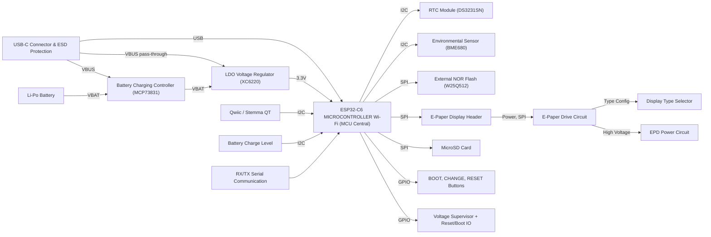

# README - OpenBook

## Diagrama bloc

---

## Funcționalitatea hardware

### Microcontroller principal
- ESP32-C6-WROOM-1-N8
  - Procesor RISC-V 32-bit
  - Conectivitate Wi-Fi 6 și Bluetooth 5.0
  - 8MB Flash (intern)
  - Alimentare 3.3V
  - Niveluri logice 3.3V

### Componente periferice și interfețe

| Componentă                      | Ref. Schematică | Interfață    | Pini ESP32 Utilizați / Descriere                                        |
| :------------------------------ | :-------------- | :----------- | :---------------------------------------------------------------------- |
| Ecran EPD (e-paper)             | J4              | SPI + GPIO   | SPI (IO7, IO27, IO6), CS (IO11), DC (IO5), RST (IO21), BUSY (IO26)      |
| Slot Card MicroSD               | J3              | SPI          | SPI (IO7=MOSI/DI, IO27=MISO/DO, IO6=SCK), CS (IO10)                       |
| Interfață USB                   | J2              | USB Native   | D- (IO13), D+ (IO14) via protecție ESD (D2)                             |
| RTC (Real Time Clock)           | IC2             | I2C          | SDA (IO19), SCL (IO20); Include Supercap (C10) pentru backup           |
| Senzor Temp/Umid/Pres/Gaz (BME) | IC3             | I2C          | SDA (IO19), SCL (IO20)                                                  |
| Încărcător Li-Po                | IC1             | Power        | MCP73831; Indicator LED încărcare (D4)                                  |
| Regulator LDO 3.3V              | IC4             | Power        | XC6220A331MR-G                                                          |
| Circuit Reset / Supraveghere    | IC5             | Power/Control| BD5229G-TR                                                              |
| Buton BOOT                      | SW1             | GPIO         | Conectat la IO8                                                         |
| Buton RESET                     | SW2             | Reset        | Conectat la linia RESET                                                 |
| MOSFET comutare EPD Power       | Q1, Q2          | Control      | Comută alimentarea 3V3_EPD                                              |

#### SPI (Serial Peripheral Interface)
- **Utilizat pentru EPD și Card SD.**
- **MOSI** (Master Out Slave In): **IO7**
- **MISO** (Master In Slave Out): **IO27**
- **SCK** (Serial Clock): **IO6**
- **SS / CS** (Slave Select / Chip Select):
    - **EPD_CS**: **IO11**
    - **SD_CS**: **IO10**

#### I2C (Inter-Integrated Circuit)
- **Utilizat pentru RTC (IC2) și Senzor BME (IC3).**
- **SDA** (Serial Data): **IO19**
- **SCL** (Serial Clock): **IO20**

#### GPIO (General Purpose Input/Output) & Alți Pini
- **EPD_DC** (Data/Command): **IO5**
- **EPD_RST** (Reset): **IO21**
- **EPD_BUSY**: **IO26**
- **USB_D-**: **IO13**
- **USB_D+**: **IO14**
- **BOOT_PIN**: **IO8**
- **RESET_PIN**: **IO3**
- **EN** (Enable): Conectat la 3.3V

## Detaliere Pini Utilizați (ESP32-C6 / U2)

| Pin ESP32 | Funcție Principală                  | Componentă Conectată / Scop                  |
| :-------- | :---------------------------------- | :------------------------------------------- |
| IO0       | GPIO                                | INT_RTC (ieșire din RTC)                     |
| IO1       | GPIO                                | 32KHZ (ieșire ceas RTC)                      |
| IO2       | SPI MISO                            | MISO (EPD + SD)                              |
| IO3       | GPIO                                | SS_SD (chip select pentru SD)                |
| IO4       | GPIO                                | EPD_BUSY                                     |
| IO5       | GPIO                                | EPD_DC                                       |
| IO6       | SPI SCK                             | SCK (EPD + SD)                               |
| IO7       | SPI MOSI                            | MOSI (EPD + SD)                              |
| IO8       | GPIO                                | IO/BOOT (buton boot)                         |
| IO10      | GPIO                                | EPD_CS                                       |
| IO11      | GPIO                                | FLASH_CS                                     |
| IO12      | GPIO                                | Neutilizat                                   |
| IO13      | USB D-                              | USB_D- (conector USB-C)                      |
| IO14      | USB D+                              | USB_D+ (conector USB-C)                      |
| IO16      | UART TX                             | TX                                           |
| IO17      | UART RX                             | RX                                           |
| IO18      | GPIO                                | RTC_RST                                      |
| IO19      | GPIO                                | I2C_PW (putere I2C)                          |
| IO20      | I2C SDA                             | SDA (RTC + BME280)                           |
| IO21      | I2C SCL                             | SCL (RTC + BME280)                           |
| IO22      | GPIO                                | EPD_RST                                      |
| IO23      | GPIO                                | Neconectat                                   |
| IO25      | GPIO                                | IO/CHANGE                                    |
| IO26      | GPIO                                | EPD_BUSY                                     |
| IO27      | SPI MISO                            | 32KHZ (ceas RTC)                             |
| EN        | Enable                              | Buton RESET (pull-up la 3.3V)                |
| VDD (3V3) | Alimentare                          | 3.3V                                         |
| GND       | Masă                                | GND                                          |

---

##  Bill of Materials

| Device                                                     | Datasheet                                                                                                                                                                                                                                                                                                                                                                                                                                                                                                                                                                                                                                                                                                                                                                                                                                                                                                                                                                                                                                                                                                                             | Purchase URL                                                                                               |
| :--------------------------------------------------------- | :------------------------------------------------------------------------------------------------------------------------------------------------------------------------------------------------------------------------------------------------------------------------------------------------------------------------------------------------------------------------------------------------------------------------------------------------------------------------------------------------------------------------------------------------------------------------------------------------------------------------------------------------------------------------------------------------------------------------------------------------------------------------------------------------------------------------------------------------------------------------------------------------------------------------------------------------------------------------------------------------------------------------------------------------------------------------------------------------------------------------------ | :--------------------------------------------------------------------------------------------------------- |
| ADAFRUIT_LEDCHIP-LED0603                                   | [Datasheet](https://www.mouser.com/datasheet/2/423/LSM0603472V_(1)-1379786.pdf) | [Purchase](https://componentsearchengine.com/part-view/LSM0603463V/Visual%20Communications%20Company)                 |
| BUTTON_CUSYOMV1                                            | [Datasheet](https://industry.panasonic.com/global/en/downloads?tab=catalog&small_g_cd=203&part_no=EVQPUJ02K)                                                                                                                                                                                                                                                                                                                                                                                                                                                                                                                                                                                                                                                                                                                                                                                                                                                                                                                                                                                                                                 | [Purchase](https://industry.panasonic.com/global/en/products/control/switch/light-touch/number/evqpuj02k)              |
| ESP32C6_VARISTORCN1812                                     | [Datasheet](https://www.tdk-electronics.tdk.com/inf/75/db/CTVS_14/Surge_protection_series.pdf)                                                                                                                                                                                                                                                                                                                                                                                                                                                                                                                                                                                                                                                                                                                                                                                                                                                                                                                                                                                                                                              | [Purchase](https://www.mouser.co.uk/ProductDetail/EPCOS-TDK/B72520T0350K062?qs=dEfas%2FXlABIszF52uu7vrg%3D%3D)          |
| ESP32_WROVER_SPARKFUN-IC-POWER_MCP73831                    | [Datasheet](https://ro.mouser.com/datasheet/2/268/MCP73831_Family_Data_Sheet_DS20001984H-3441711.pdf)                                                                                                                                                                                                                                                                                                                                                                                                                                                                                                                                                                                                                                                                                                                                                                                                                                                                                                                                                                                                                                         | [Purchase](https://ro.mouser.com/ProductDetail/Microchip-Technology/MCP73831T-5ACI-OT?qs=hH%252BOa0VZEiAcgAcEkuamXg%3D%3D) |
| SAMACSYS_PARTS_USB4110-GF-A                                | [Datasheet](https://ro.mouser.com/datasheet/2/837/GCT_USB4110_Product_Drawing___20k_cycles-3455479.pdf)                                                                                                                                                                                                                                                                                                                                                                                                                                                                                                                                                                                                                                                                                                                                                                                                                                                                                                                                                                                                                                         | [Purchase](https://componentsearchengine.com/part-view/XC6220A331MR-G/Torex)                                         |
| SJ                                                         | [Datasheet](https://analytics.supplyframe.com/trackingservlet/track/?r=0x34EY99PS_gIu2qWuzU9_U842M9-un2szqNoXX0OQ9lqbiEKGN3BJ73jgvlrgiXR89Peb0evqc4GXoUXllBhuC-t-jUChl_ve9sxyIbn9itd6HouwDNkBJ6EbvJG_W1dvQ33O37oQvrBIGmAmWf7WaTE1x7V-fhYVb8BzYSgNk10lRrx9ydF05rSu_yF-RcTLzrvVqKpyEMsu1tWML3F5NsDK3eYvMDWLFReFpcpYcQT6VJIIHxe2IkeuwFaNGGth_bPArqAVRLfjMYZDlSoV5_e61wrdrMeBLi53h3S0fpxDEX4TLvuLsi8JJGhgQx2voMmyqY6gjXW05FuTS5Qg0wN73a4RXBC7fJniBn8yriZXPMyggVMPVjL_9j3a1i4URi-pLFft7-_hLLLd0kX-uUouNvW0LzSWKkqNJlO6y1UWqDYMRLOE2dWFnrHj_3dksoFiwKXmoFw3sFOj5NXRaA6wxikMMMYZ3-gooWmAhCzEczgqDfXEQesLsiJT4-XFNfgt7LRuH9NmM38ieQHEqyxGFi6kd4X6I0KTHQLg2-V8XlyekPtBCU8gDdPBhOQ17Oj7rYC0lA0EcA__td0qxqTJ8t7VxJcv7gPOP6anfgCpsnupcmJj6zFPjIrtqj4NWwwbbecRBKOv7doyTdwmzqoyGGrGPY7DQKSHciWg8cX6Hc3D7dmNS4mPEOJOOKewle43KybI4UJMP_UcC5JA) | [Purchase](https://componentsearchengine.com/part-view/R0402%201%25%20100%20K%20(RC0402FR-07100KL)/YAGEO)              |
| ESP32_WROVER_EAGLE-LTSPICE_RR0402                          | [Datasheet](https://analytics.supplyframe.com/trackingservlet/track/?r=0x34EY99PS_gIu2qWuzU9_U842M9-un2szqNoXX0OQ9lqbiEKGN3BJ73jgvlrgiXR89Peb0evqc4GXoUXllBhuC-t-jUChl_ve9sxyIbn9itd6HouwDNkBJ6EbvJG_W1dvQ33O37oQvrBIGmAmWf7WaTE1x7V-fhYVb8BzYSgNk10lRrx9ydF05rSu_yF-RcTLzrvVqKpyEMsu1tWML3F5NsDK3eYvMDWLFReFpcpYcQT6VJIIHxe2IkeuwFaNGGth_bPArqAVRLfjMYZDlSoV5_e61wrdrMeBLi53h3S0fpxDEX4TLvuLsi8JJGhgQx2voMmyqY6gjXW05FuTS5Qg0wN73a4RXBC7fJniBn8yriZXPMyggVMPVjL_9j3a1i4URi-pLFft7-_hLLLd0kX-uUouNvW0LzSWKkqNJlO6y1UWqDYMRLOE2dWFnrHj_3dksoFiwKXmoFw3sFOj5NXRaA6wxikMMMYZ3-gooWmAhCzEczgqDfXEQesLsiJT4-XFNfgt7LRuH9NmM38ieQHEqyxGFi6kd4X6I0KTHQLg2-V8XlyekPtBCU8gDdPBhOQ17Oj7rYC0lA0EcA__td0qxqTJ8t7VxJcv7gPOP6anfgCpsnupcmJj6zFPjIrtqj4NWwwbbecRBKOv7doyTdwmzqoyGGrGPY7DQKSHciWg8cX6Hc3D7dmNS4mPEOJOOKewle43KybI4UJMP_UcC5JA) | [Purchase](https://componentsearchengine.com/part-view/R0402%201%25%20100%20K%20(RC0402FR-07100KL)/YAGEO)              |
| ESP32_WROVER_EAGLE-LTSPICE_RR0402                          | [Datasheet](https://analytics.supplyframe.com/trackingservlet/track/?r=0x34EY99PS_gIu2qWuzU9_U842M9-un2szqNoXX0OQ9lqbiEKGN3BJ73jgvlrgiXR89Peb0evqc4GXoUXllBhuC-t-jUChl_ve9sxyIbn9itd6HouwDNkBJ6EbvJG_W1dvQ33O37oQvrBIGmAmWf7WaTE1x7V-fhYVb8BzYSgNk10lRrx9ydF05rSu_yF-RcTLzrvVqKpyEMsu1tWML3F5NsDK3eYvMDWLFReFpcpYcQT6VJIIHxe2IkeuwFaNGGth_bPArqAVRLfjMYZDlSoV5_e61wrdrMeBLi53h3S0fpxDEX4TLvuLsi8JJGhgQx2voMmyqY6gjXW05FuTS5Qg0wN73a4RXBC7fJniBn8yriZXPMyggVMPVjL_9j3a1i4URi-pLFft7-_hLLLd0kX-uUouNvW0LzSWKkqNJlO6y1UWqDYMRLOE2dWFnrHj_3dksoFiwKXmoFw3sFOj5NXRaA6wxikMMMYZ3-gooWmAhCzEczgqDfXEQesLsiJT4-XFNfgt7LRuH9NmM38ieQHEqyxGFi6kd4X6I0KTHQLg2-V8XlyekPtBCU8gDdPBhOQ17Oj7rYC0lA0EcA__td0qxqTJ8t7VxJcv7gPOP6anfgCpsnupcmJj6zFPjIrtqj4NWwwbbecRBKOv7doyTdwmzqoyGGrGPY7DQKSHciWg8cX6Hc3D7dmNS4mPEOJOOKewle43KybI4UJMP_UcC5JA) | [Purchase](https://componentsearchengine.com/part-view/R0402%201%25%20100%20K%20(RC0402FR-07100KL)/YAGEO)              |
| EAGLE-LTSPICE_CC0402                                       | [Datasheet](https://ro.mouser.com/datasheet/2/447/UPY_GP_NP0_16V_to_50V_18-1730511.pdf) | [Purchase](https://componentsearchengine.com/part-view/0805Y2500471FCR/Knowles)                                      |
| RCL_CPOL-EUCT3528                                          | [Datasheet](https://analytics.supplyframe.com/trackingservlet/track/?r=0x34EY99PS_gIu2qWuzU9_U842M9-un2szqNoXX0OQ9lqbiEKGN3BJ73jgvlrgiXR89Peb0evqc4GXoUXllBhuC-t-jUChl_ve9sxyIbn9h563cqbgR_5FGhiODcKT6azv7bSl5nuf_JbmcPl67LIOD-eFH0dQ5fGmWruxh3uWK4JYZuB-i4MbVubNKkJqcAl7rmj7IKAxZwWIidrEE_O9YHItfw9jZIKvxDC3Fmxf2A3jPViXxxSb8puVdYU1vjFrGj4C4j3MQJPvMTLLXd109bZbh1EHlqKKHwGAPIsJR5wnCkYKjt_galChG2g-tUGhuZxxGHVJAB9kHFTePl2_fOpK4rSyv0E39-OWELIXBGhhMPJGAAGKQ83JEdAPJEN1TAtcAMrHfEumpc1S_xNxIdcCjpaqX0g5-E_9PFrJYHw2aOeJGTED4JbLnJvUy704Y-nl5NdOMg1BPRC9YHY2X8PJly7fP8q8mX88KmeJAdNrmW_LmmbH7vpy4MJXP29Xzxz2HlQU883Gl9rboWdRognDi_xz_Ik6wrQ9G4ExNFZzyX8xSZEEEslkB89dTj) | [Purchase](https://componentsearchengine.com/part-view/0805Y2500471FCR/Knowles)                                      |
| ESP32_WROVER_EAGLE-LTSPICE_RR0402                          | [Datasheet](https://analytics.supplyframe.com/trackingservlet/track/?r=0x34EY99PS_gIu2qWuzU9_U842M9-un2szqNoXX0OQ9lqbiEKGN3BJ73jgvlrgiXR89Peb0evqc4GXoUXllBhuC-t-jUChl_ve9sxyIbn9itd6HouwDNkBJ6EbvJG_W1dvQ33O37oQvrBIGmAmWf7WaTE1x7V-fhYVb8BzYSgNk10lRrx9ydF05rSu_yF-RcTLzrvVqKpyEMsu1tWML3F5NsDK3eYvMDWLFReFpcpYcQT6VJIIHxe2IkeuwFaNGGth_bPArqAVRLfjMYZDlSoV5_e61wrdrMeBLi53h3S0fpxDEX4TLvuLsi8JJGhgQx2voMmyqY6gjXW05FuTS5Qg0wN73a4RXBC7fJniBn8yriZXPMyggVMPVjL_9j3a1i4URi-pLFft7-_hLLLd0kX-uUouNvW0LzSWKkqNJlO6y1UWqDYMRLOE2dWFnrHj_3dksoFiwKXmoFw3sFOj5NXRaA6wxikMMMYZ3-gooWmAhCzEczgqDfXEQesLsiJT4-XFNfgt7LRuH9NmM38ieQHEqyxGFi6kd4X6I0KTHQLg2-V8XlyekPtBCU8gDdPBhOQ17Oj7rYC0lA0EcA__td0qxqTJ8t7VxJcv7gPOP6anfgCpsnupcmJj6zFPjIrtqj4NWwwbbecRBKOv7doyTdwmzqoyGGrGPY7DQKSHciWg8cX6Hc3D7dmNS4mPEOJOOKewle43KybI4UJMP_UcC5JA) | [Purchase](https://componentsearchengine.com/part-view/R0402%201%25%20100%20K%20(RC0402FR-07100KL)/YAGEO)              |
| ESP32_WROVER_EAGLE-LTSPICE_RR0402                          | [Datasheet](https://analytics.supplyframe.com/trackingservlet/track/?r=0x34EY99PS_gIu2qWuzU9_U842M9-un2szqNoXX0OQ9lqbiEKGN3BJ73jgvlrgiXR89Peb0evqc4GXoUXllBhuC-t-jUChl_ve9sxyIbn9itd6HouwDNkBJ6EbvJG_W1dvQ33O37oQvrBIGmAmWf7WaTE1x7V-fhYVb8BzYSgNk10lRrx9ydF05rSu_yF-RcTLzrvVqKpyEMsu1tWML3F5NsDK3eYvMDWLFReFpcpYcQT6VJIIHxe2IkeuwFaNGGth_bPArqAVRLfjMYZDlSoV5_e61wrdrMeBLi53h3S0fpxDEX4TLvuLsi8JJGhgQx2voMmyqY6gjXW05FuTS5Qg0wN73a4RXBC7fJniBn8yriZXPMyggVMPVjL_9j3a1i4URi-pLFft7-_hLLLd0kX-uUouNvW0LzSWKkqNJlO6y1UWqDYMRLOE2dWFnrHj_3dksoFiwKXmoFw3sFOj5NXRaA6wxikMMMYZ3-gooWmAhCzEczgqDfXEQesLsiJT4-XFNfgt7LRuH9NmM38ieQHEqyxGFi6kd4X6I0KTHQLg2-V8XlyekPtBCU8gDdPBhOQ17Oj7rYC0lA0EcA__td0qxqTJ8t7VxJcv7gPOP6anfgCpsnupcmJj6zFPjIrtqj4NWwwbbecRBKOv7doyTdwmzqoyGGrGPY7DQKSHciWg8cX6Hc3D7dmNS4mPEOJOOKewle43KybI4UJMP_UcC5JA) | [Purchase](https://componentsearchengine.com/part-view/R0402%201%25%20100%20K%20(RC0402FR-07100KL)/YAGEO)              |
| EAGLE-LTSPICE_CC0402                                       | [Datasheet](https://analytics.supplyframe.com/trackingservlet/track/?r=0x34EY99PS_gIu2qWuzU9_U842M9-un2szqNoXX0OQ9lqbiEKGN3BJ73jgvlrgiXR89Peb0evqc4GXoUXllBhuC-t-jUChl_ve9sxyIbn9h563cqbgR_5FGhiODcKT6azv7bSl5nuf_JbmcPl67LIOD-eFH0dQ5fGmWruxh3uWK4JYZuB-i4MbVubNKkJqcAl7rmj7IKAxZwWIidrEE_O9YHItfw9jZIKvxDC3Fmxf2A3jPViXxxSb8puVdYU1vjFrGj4C4j3MQJPvMTLLXd109bZbh1EHlqKKHwGAPIsJR5wnCkYKjt_galChG2g-tUGhuZxxGHVJAB9kHFTePl2_fOpK4rSyv0E39-OWELIXBGhhMPJGAAGKQ83JEdAPJEN1TAtcAMrHfEumpc1S_xNxIdcCjpaqX0g5-E_9PFrJYHw2aOeJGTED4JbLnJvUy704Y-nl5NdOMg1BPRC9YHY2X8PJly7fP8q8mX88KmeJAdNrmW_LmmbH7vpy4MJXP29Xzxz2HlQU883Gl9rboWdRognDi_xz_Ik6wrQ9G4ExNFZzyX8xSZEEEslkB89dTj) | [Purchase](https://componentsearchengine.com/part-view/0805Y2500471FCR/Knowles)                                      |
| 112A-TAAR-R03_ATTEND                                       |              [Datasheet](https://www.attend.com.tw/data/download/file/112A-TAAR-R03_Spec.pdf)                                                                                                                                                                                                                                                                                                                                                                                                                                                                                                                                                                                                                                                                                                                                                                                                                                                                                                                                                                                                                                                                                                                   | [Purchase](https://store.comet.srl.ro/Catalogue/Product/43497/)                                                       |
| ESP32_WROVER_EAGLE-LTSPICE_RR0402                          | [Datasheet](https://analytics.supplyframe.com/trackingservlet/track/?r=0x34EY99PS_gIu2qWuzU9_U842M9-un2szqNoXX0OQ9lqbiEKGN3BJ73jgvlrgiXR89Peb0evqc4GXoUXllBhuC-t-jUChl_ve9sxyIbn9itd6HouwDNkBJ6EbvJG_W1dvQ33O37oQvrBIGmAmWf7WaTE1x7V-fhYVb8BzYSgNk10lRrx9ydF05rSu_yF-RcTLzrvVqKpyEMsu1tWML3F5NsDK3eYvMDWLFReFpcpYcQT6VJIIHxe2IkeuwFaNGGth_bPArqAVRLfjMYZDlSoV5_e61wrdrMeBLi53h3S0fpxDEX4TLvuLsi8JJGhgQx2voMmyqY6gjXW05FuTS5Qg0wN73a4RXBC7fJniBn8yriZXPMyggVMPVjL_9j3a1i4URi-pLFft7-_hLLLd0kX-uUouNvW0LzSWKkqNJlO6y1UWqDYMRLOE2dWFnrHj_3dksoFiwKXmoFw3sFOj5NXRaA6wxikMMMYZ3-gooWmAhCzEczgqDfXEQesLsiJT4-XFNfgt7LRuH9NmM38ieQHEqyxGFi6kd4X6I0KTHQLg2-V8XlyekPtBCU8gDdPBhOQ17Oj7rYC0lA0EcA__td0qxqTJ8t7VxJcv7gPOP6anfgCpsnupcmJj6zFPjIrtqj4NWwwbbecRBKOv7doyTdwmzqoyGGrGPY7DQKSHciWg8cX6Hc3D7dmNS4mPEOJOOKewle43KybI4UJMP_UcC5JA) | [Purchase](https://componentsearchengine.com/part-view/R0402%201%25%20100%20K%20(RC0402FR-07100KL)/YAGEO)              |
| EAGLE-LTSPICE_CC0402                                       | [Datasheet](https://analytics.supplyframe.com/trackingservlet/track/?r=0x34EY99PS_gIu2qWuzU9_U842M9-un2szqNoXX0OQ9lqbiEKGN3BJ73jgvlrgiXR89Peb0evqc4GXoUXllBhuC-t-jUChl_ve9sxyIbn9h563cqbgR_5FGhiODcKT6azv7bSl5nuf_JbmcPl67LIOD-eFH0dQ5fGmWruxh3uWK4JYZuB-i4MbVubNKkJqcAl7rmj7IKAxZwWIidrEE_O9YHItfw9jZIKvxDC3Fmxf2A3jPViXxxSb8puVdYU1vjFrGj4C4j3MQJPvMTLLXd109bZbh1EHlqKKHwGAPIsJR5wnCkYKjt_galChG2g-tUGhuZxxGHVJAB9kHFTePl2_fOpK4rSyv0E39-OWELIXBGhhMPJGAAGKQ83JEdAPJEN1TAtcAMrHfEumpc1S_xNxIdcCjpaqX0g5-E_9PFrJYHw2aOeJGTED4JbLnJvUy704Y-nl5NdOMg1BPRC9YHY2X8PJly7fP8q8mX88KmeJAdNrmW_LmmbH7vpy4MJXP29Xzxz2HlQU883Gl9rboWdRognDi_xz_Ik6wrQ9G4ExNFZzyX8xSZEEEslkB89dTj) | [Purchase](https://componentsearchengine.com/part-view/0805Y2500471FCR/Knowles)                                      |
| EAGLE-LTSPICE_CC0402                                       | [Datasheet](https://analytics.supplyframe.com/trackingservlet/track/?r=0x34EY99PS_gIu2qWuzU9_U842M9-un2szqNoXX0OQ9lqbiEKGN3BJ73jgvlrgiXR89Peb0evqc4GXoUXllBhuC-t-jUChl_ve9sxyIbn9h563cqbgR_5FGhiODcKT6azv7bSl5nuf_JbmcPl67LIOD-eFH0dQ5fGmWruxh3uWK4JYZuB-i4MbVubNKkJqcAl7rmj7IKAxZwWIidrEE_O9YHItfw9jZIKvxDC3Fmxf2A3jPViXxxSb8puVdYU1vjFrGj4C4j3MQJPvMTLLXd109bZbh1EHlqKKHwGAPIsJR5wnCkYKjt_galChG2g-tUGhuZxxGHVJAB9kHFTePl2_fOpK4rSyv0E39-OWELIXBGhhMPJGAAGKQ83JEdAPJEN1TAtcAMrHfEumpc1S_xNxIdcCjpaqX0g5-E_9PFrJYHw2aOeJGTED4JbLnJvUy704Y-nl5NdOMg1BPRC9YHY2X8PJly7fP8q8mX88KmeJAdNrmW_LmmbH7vpy4MJXP29Xzxz2HlQU883Gl9rboWdRognDi_xz_Ik6wrQ9G4ExNFZzyX8xSZEEEslkB89dTj) | [Purchase](https://componentsearchengine.com/part-view/0805Y2500471FCR/Knowles)                                      |
| ESP32_WROVER_EAGLE-LTSPICE_RR0402                          | [Datasheet](https://analytics.supplyframe.com/trackingservlet/track/?r=0x34EY99PS_gIu2qWuzU9_U842M9-un2szqNoXX0OQ9lqbiEKGN3BJ73jgvlrgiXR89Peb0evqc4GXoUXllBhuC-t-jUChl_ve9sxyIbn9itd6HouwDNkBJ6EbvJG_W1dvQ33O37oQvrBIGmAmWf7WaTE1x7V-fhYVb8BzYSgNk10lRrx9ydF05rSu_yF-RcTLzrvVqKpyEMsu1tWML3F5NsDK3eYvMDWLFReFpcpYcQT6VJIIHxe2IkeuwFaNGGth_bPArqAVRLfjMYZDlSoV5_e61wrdrMeBLi53h3S0fpxDEX4TLvuLsi8JJGhgQx2voMmyqY6gjXW05FuTS5Qg0wN73a4RXBC7fJniBn8yriZXPMyggVMPVjL_9j3a1i4URi-pLFft7-_hLLLd0kX-uUouNvW0LzSWKkqNJlO6y1UWqDYMRLOE2dWFnrHj_3dksoFiwKXmoFw3sFOj5NXRaA6wxikMMMYZ3-gooWmAhCzEczgqDfXEQesLsiJT4-XFNfgt7LRuH9NmM38ieQHEqyxGFi6kd4X6I0KTHQLg2-V8XlyekPtBCU8gDdPBhOQ17Oj7rYC0lA0EcA__td0qxqTJ8t7VxJcv7gPOP6anfgCpsnupcmJj6zFPjIrtqj4NWwwbbecRBKOv7doyTdwmzqoyGGrGPY7DQKSHciWg8cX6Hc3D7dmNS4mPEOJOOKewle43KybI4UJMP_UcC5JA) | [Purchase](https://componentsearchengine.com/part-view/R0402%201%25%20100%20K%20(RC0402FR-07100KL)/YAGEO)              |
| ESP32_WROVER_EAGLE-LTSPICE_RR0402                          | [Datasheet](https://analytics.supplyframe.com/trackingservlet/track/?r=0x34EY99PS_gIu2qWuzU9_U842M9-un2szqNoXX0OQ9lqbiEKGN3BJ73jgvlrgiXR89Peb0evqc4GXoUXllBhuC-t-jUChl_ve9sxyIbn9itd6HouwDNkBJ6EbvJG_W1dvQ33O37oQvrBIGmAmWf7WaTE1x7V-fhYVb8BzYSgNk10lRrx9ydF05rSu_yF-RcTLzrvVqKpyEMsu1tWML3F5NsDK3eYvMDWLFReFpcpYcQT6VJIIHxe2IkeuwFaNGGth_bPArqAVRLfjMYZDlSoV5_e61wrdrMeBLi53h3S0fpxDEX4TLvuLsi8JJGhgQx2voMmyqY6gjXW05FuTS5Qg0wN73a4RXBC7fJniBn8yriZXPMyggVMPVjL_9j3a1i4URi-pLFft7-_hLLLd0kX-uUouNvW0LzSWKkqNJlO6y1UWqDYMRLOE2dWFnrHj_3dksoFiwKXmoFw3sFOj5NXRaA6wxikMMMYZ3-gooWmAhCzEczgqDfXEQesLsiJT4-XFNfgt7LRuH9NmM38ieQHEqyxGFi6kd4X6I0KTHQLg2-V8XlyekPtBCU8gDdPBhOQ17Oj7rYC0lA0EcA__td0qxqTJ8t7VxJcv7gPOP6anfgCpsnupcmJj6zFPjIrtqj4NWwwbbecRBKOv7doyTdwmzqoyGGrGPY7DQKSHciWg8cX6Hc3D7dmNS4mPEOJOOKewle43KybI4UJMP_UcC5JA) | [Purchase](https://componentsearchengine.com/part-view/R0402%201%25%20100%20K%20(RC0402FR-07100KL)/YAGEO)              |
| ESP32_WROVER_SPARKFUN-DISCRETESEMI_MOSFET_PCH-DMG2305UX-7 | [Datasheet](https://analytics.supplyframe.com/trackingservlet/track/?r=0x34EY99PS_gIu2qWuzU9_U842M9-un2szqNoXX0OQ9lqbiEKGN3BJ73jgvlrgiXR89Peb0evqc4GXoUXllBhuC-t-jUChl_ve9sxyIbn9htqjPHN9-H5PBy53yJrrJZbBH4NAdcIMgEdV_gE1O6mVpxBjQq-HnrRVl4ju3mUj1MvOu9WoqnIQyy7W1YwvcX9VCRJhgRdTTXzdu_kskJxI7qHOaJ0KNYNdgDqe7ulUDDBYEvyQzFh2GA3-28PfZUrgL3V_Lp9QnbJWkRGpsoauJlc8zKCBUw9WMv_2PdrWLhRGL6ksV-3v7-Esst3SRf65Si429bQvNJYqSo0mU7rLVRaoNgxEs4TZ1YWeseP_d2SygWLApeagXDewU6Pk1ddWdYU4uXGjkOLNAQNTd3lULMRzOCoN9cRB6wuyIlPj5cU1-C3stG4f02YzfyJ5AcSrLEYWLqR3hfojQpMdAuDb5XxeXJ6Q-0EJTyAN08GE5IU7v-fDrD_q-Vag1rwTbBavWRcsShwa_HGaTwIgGWIRKUZFpYTAm1NA4_5an7HefUXWkuoQm8jiWo1ELn1nvqewle43KybI4UJMP_UcC5JA) | [Purchase](https://componentsearchengine.com/part-view/DMG2305UX-7/Diodes%20Incorporated)                            |
| ESP32_WROVER_EAGLE-LTSPICE_RR0402                          | [Datasheet](https://analytics.supplyframe.com/trackingservlet/track/?r=0x34EY99PS_gIu2qWuzU9_U842M9-un2szqNoXX0OQ9lqbiEKGN3BJ73jgvlrgiXR89Peb0evqc4GXoUXllBhuC-t-jUChl_ve9sxyIbn9itd6HouwDNkBJ6EbvJG_W1dvQ33O37oQvrBIGmAmWf7WaTE1x7V-fhYVb8BzYSgNk10lRrx9ydF05rSu_yF-RcTLzrvVqKpyEMsu1tWML3F5NsDK3eYvMDWLFReFpcpYcQT6VJIIHxe2IkeuwFaNGGth_bPArqAVRLfjMYZDlSoV5_e61wrdrMeBLi53h3S0fpxDEX4TLvuLsi8JJGhgQx2voMmyqY6gjXW05FuTS5Qg0wN73a4RXBC7fJniBn8yriZXPMyggVMPVjL_9j3a1i4URi-pLFft7-_hLLLd0kX-uUouNvW0LzSWKkqNJlO6y1UWqDYMRLOE2dWFnrHj_3dksoFiwKXmoFw3sFOj5NXRaA6wxikMMMYZ3-gooWmAhCzEczgqDfXEQesLsiJT4-XFNfgt7LRuH9NmM38ieQHEqyxGFi6kd4X6I0KTHQLg2-V8XlyekPtBCU8gDdPBhOQ17Oj7rYC0lA0EcA__td0qxqTJ8t7VxJcv7gPOP6anfgCpsnupcmJj6zFPjIrtqj4NWwwbbecRBKOv7doyTdwmzqoyGGrGPY7DQKSHciWg8cX6Hc3D7dmNS4mPEOJOOKewle43KybI4UJMP_UcC5JA) | [Purchase](https://componentsearchengine.com/part-view/R0402%201%25%20100%20K%20(RC0402FR-07100KL)/YAGEO)              |
| EAGLE-LTSPICE_CC0402                                       | [Datasheet](https://analytics.supplyframe.com/trackingservlet/track/?r=0x34EY99PS_gIu2qWuzU9_U842M9-un2szqNoXX0OQ9lqbiEKGN3BJ73jgvlrgiXR89Peb0evqc4GXoUXllBhuC-t-jUChl_ve9sxyIbn9h563cqbgR_5FGhiODcKT6azv7bSl5nuf_JbmcPl67LIOD-eFH0dQ5fGmWruxh3uWK4JYZuB-i4MbVubNKkJqcAl7rmj7IKAxZwWIidrEE_O9YHItfw9jZIKvxDC3Fmxf2A3jPViXxxSb8puVdYU1vjFrGj4C4j3MQJPvMTLLXd109bZbh1EHlqKKHwGAPIsJR5wnCkYKjt_galChG2g-tUGhuZxxGHVJAB9kHFTePl2_fOpK4rSyv0E39-OWELIXBGhhMPJGAAGKQ83JEdAPJEN1TAtcAMrHfEumpc1S_xNxIdcCjpaqX0g5-E_9PFrJYHw2aOeJGTED4JbLnJvUy704Y-nl5NdOMg1BPRC9YHY2X8PJly7fP8q8mX88KmeJAdNrmW_LmmbH7vpy4MJXP29Xzxz2HlQU883Gl9rboWdRognDi_xz_Ik6wrQ9G4ExNFZzyX8xSZEEEslkB89dTj) | [Purchase](https://componentsearchengine.com/part-view/0805Y2500471FCR/Knowles)                                      |
| EAGLE-LTSPICE_CC0402                                       | [Datasheet](https://analytics.supplyframe.com/trackingservlet/track/?r=0x34EY99PS_gIu2qWuzU9_U842M9-un2szqNoXX0OQ9lqbiEKGN3BJ73jgvlrgiXR89Peb0evqc4GXoUXllBhuC-t-jUChl_ve9sxyIbn9h563cqbgR_5FGhiODcKT6azv7bSl5nuf_JbmcPl67LIOD-eFH0dQ5fGmWruxh3uWK4JYZuB-i4MbVubNKkJqcAl7rmj7IKAxZwWIidrEE_O9YHItfw9jZIKvxDC3Fmxf2A3jPViXxxSb8puVdYU1vjFrGj4C4j3MQJPvMTLLXd109bZbh1EHlqKKHwGAPIsJR5wnCkYKjt_galChG2g-tUGhuZxxGHVJAB9kHFTePl2_fOpK4rSyv0E39-OWELIXBGhhMPJGAAGKQ83JEdAPJEN1TAtcAMrHfEumpc1S_xNxIdcCjpaqX0g5-E_9PFrJYHw2aOeJGTED4JbLnJvUy704Y-nl5NdOMg1BPRC9YHY2X8PJly7fP8q8mX88KmeJAdNrmW_LmmbH7vpy4MJXP29Xzxz2HlQU883Gl9rboWdRognDi_xz_Ik6wrQ9G4ExNFZzyX8xSZEEEslkB89dTj) | [Purchase](https://componentsearchengine.com/part-view/0805Y2500471FCR/Knowles)                                      |
| ESP32_WROVER_EAGLE-LTSPICE_RR0402                          | [Datasheet](https://analytics.supplyframe.com/trackingservlet/track/?r=0x34EY99PS_gIu2qWuzU9_U842M9-un2szqNoXX0OQ9lqbiEKGN3BJ73jgvlrgiXR89Peb0evqc4GXoUXllBhuC-t-jUChl_ve9sxyIbn9itd6HouwDNkBJ6EbvJG_W1dvQ33O37oQvrBIGmAmWf7WaTE1x7V-fhYVb8BzYSgNk10lRrx9ydF05rSu_yF-RcTLzrvVqKpyEMsu1tWML3F5NsDK3eYvMDWLFReFpcpYcQT6VJIIHxe2IkeuwFaNGGth_bPArqAVRLfjMYZDlSoV5_e61wrdrMeBLi53h3S0fpxDEX4TLvuLsi8JJGhgQx2voMmyqY6gjXW05FuTS5Qg0wN73a4RXBC7fJniBn8yriZXPMyggVMPVjL_9j3a1i4URi-pLFft7-_hLLLd0kX-uUouNvW0LzSWKkqNJlO6y1UWqDYMRLOE2dWFnrHj_3dksoFiwKXmoFw3sFOj5NXRaA6wxikMMMYZ3-gooWmAhCzEczgqDfXEQesLsiJT4-XFNfgt7LRuH9NmM38ieQHEqyxGFi6kd4X6I0KTHQLg2-V8XlyekPtBCU8gDdPBhOQ17Oj7rYC0lA0EcA__td0qxqTJ8t7VxJcv7gPOP6anfgCpsnupcmJj6zFPjIrtqj4NWwwbbecRBKOv7doyTdwmzqoyGGrGPY7DQKSHciWg8cX6Hc3D7dmNS4mPEOJOOKewle43KybI4UJMP_UcC5JA) | [Purchase](https://componentsearchengine.com/part-view/R0402%201%25%20100%20K%20(RC0402FR-07100KL)/YAGEO)              |
| 744043680IND_4828-WE-TPC_WRE                                | [Datasheet](https://www.we-online.com/components/products/datasheet/744043680.pdf)                                                                                                                                                                                                                                                                                                                                                                                                                                                                                                                                                                                                                                                                                                                                                                                                                                                                                                                                                                                                                                                | [Purchase](https://eu.mouser.com/ProductDetail/Wurth-Elektronik/744043680?qs=PGXP4M47uW6VkZq%252BkzjrHA%3D%3D)         |
| BD5229G-TR                                                 | [Datasheet](https://analytics.supplyframe.com/trackingservlet/track/?r=0x34EY99PS_gIu2qWuzU9_U842M9-un2szqNoXX0OQ9lqbiEKGN3BJ73jgvlrgiXR89Peb0evqc4GXoUXllBhuC-t-jUChl_ve9sxyIbn9jRihNQSXdSI3BytPQ01W2mbDl-BrHnDitFFECll9ZQTojC49rQmJNJKdgEcm3aSYjKEsMXPl-eGs-pMLJ6GfjQ2BiKCrz1Zc4X-qzG_VKV2vSzv5P64Ul7Il20ycllQHFjlUO2yTCSMr3lB_jTotw40hK-OEmTdpXx-FpzhJ86P5OvAlgiTQyMiC4Ffnw4yYxkQBVqaiFBg7qrqEqqVSG5v66qM9MTFYImVZ49_rSfStbzcxZuFs4E34nEuhMtfiLv73XN0MPNP_8SDUn4gYOfd2D69K7f8EasBV2rTRmNoH6mvceAHA0P3Cv8s6IaOOTvPS6jR1oAjYl8BoXRPWUJ5aLjnpvIINTY1WwHJCfgxYIdG_N4syc-r6Zk6suvYc31sqvLLuSSOT8tdE2JjOemnsC60ps8LwboHBeA2g6oA7NNs5-4F5aeZhiCtD42Z5ROwjQ2LlPtjcLlvpGBeHIItUY6A8k3oFuRSm1vUF3wN8_AuXjXENQ3hBxb6uKJO6IWX4DfXH-rBL1GXdAFk5fJOL8ToAbK603Fof1xxy6UwA) | [Purchase](https://componentsearchengine.com/part-view/BD5229G-TR/ROHM%20Semiconductor)                              |
| ESP32_WROVER_BME680_BME680                                 | [Datasheet](https://www.snapeda.com/parts/BME680/Bosch%20Sensortec/datasheet/)                                                                                                                                                                                                                                                                                                                                                                                                                                                                                                                                                                                                                                                                                                                                                                                                                                                                                                                                                                                                                                                        | [Purchase](https://www.snapeda.com/parts/BME680/Bosch/view-part/?welcome=home)                                        |
| CPH3225A                                                   | [Datasheet](https://www.snapeda.com/parts/CPH3225A/Seiko%20Instruments/datasheet/)                                                                                                                                                                                                                                                                                                                                                                                                                                                                                                                                                                                                                                                                                                                                                                                                                                                                                                                                                                                                                                                    | [Purchase](https://www.snapeda.com/parts/CPH3225A/Seiko+Instruments/view-part/?ref=eda)                               |
| DS3231SN#                                                  | [Datasheet](https://www.snapeda.com/parts/DS3231SN%23/Analog%20Devices/datasheet/)                                                                                                                                                                                                                                                                                                                                                                                                                                                                                                                                                                                                                                                                                                                                                                                                                                                                                                                                                                                                                                                    | [Purchase](https://www.snapeda.com/parts/DS3231SN%23/Analog+Devices/view-part/?ref=eda)                               |
| ESP32-C6-WROOM-1-N8                                        | [Datasheet](https://www.snapeda.com/parts/ESP32-C6-WROOM-1-N8/Espressif%20Systems/datasheet/)                                                                                                                                                                                                                                                                                                                                                                                                                                                                                                                                                                                                                                                                                                                                                                                                                                                                                                                                                                                                                                              | [Purchase](https://www.snapeda.com/parts/ESP32-C6-WROOM-1-N8/Espressif+Systems/view-part/?ref=eda)                     |
| FH34SRJ-24S-0.5SH_99_                                      | [Datasheet](https://analytics.supplyframe.com/trackingservlet/track/?r=0x34EY99PS_gIu2qWuzU9_U842M9-un2szqNoXX0OQ9lqbiEKGN3BJ73jgvlrgiXR89Peb0evqc4GXoUXllBhuC-t-jUChl_ve9sxyIbn9iB_3F6n5b2GpxjFkeCFGxjIjl2pAOVy2zcoQGQxuo036k82aGL63A7iug3M0vDx44b9y4q5Rgkc_UTcoUbz-EFKm35u_Pt-UF5-Qq6wcvjqqlBMb2f4RZCO7jxguRPFrgtzlu-fR4ingqEGNbtkagfE0rBzjLh92oZx50eVDJ4S4lYtlvL7eewixZfJaSGhszSFaidu3jZQN2CJ5l526is_Bln0SGRQRi7Gb6appE-IrQdh73ghyJapvhN_Gz1FnJ0ch-bk2kGv6AfSzLCX2TSYga1x68e32CNZt8xWLj3NfJVDOHS8ZS42zhawi9DWA1aRL3hvdnRcB352G10IL46169qwDsBVTcBHABUmJOZLUiFPAKnU5dw3RkOVJIhv6hb0GJ6_iu4F4MNWLmP2ofARWc8l_MUmRBBLJZAfPXU4w) | [Purchase](https://componentsearchengine.com/part-view/XC6220A331MR-G/Torex)                                         |
| MAX17048G+T10                                              | [Datasheet](https://www.snapeda.com/parts/MAX17048G+T10/Analog%20Devices/datasheet/)                                                                                                                                                                                                                                                                                                                                                                                                                                                                                                                                                                                                                                                                                                                                                                                                                                                                                                                                                                                                                                                   | [Purchase](https://www.snapeda.com/parts/MAX17048G+T10/Analog+Devices/view-part/?ref=eda)                             |
| MBR0530                                                    | [Datasheet](https://ro.mouser.com/datasheet/2/40/schottky-3165252.pdf)                                                                                                                                                                                                                                                                                                                                                                                                                                                                                                                                                                                                                                                                                                                                                                                                                                                                                                                                                                                                                                                              | [Purchase](https://eu.mouser.com/ProductDetail/KYOCERA-AVX/SD0805S020S1R0?qs=jCA%252BPfw4LHbpkAoSnwrdjw%3D%3D)        |
| PGB1010603MR                                               | [Datasheet](https://www.snapeda.com/parts/PGB1010603MR/Littelfuse%20Inc./datasheet/)                                                                                                                                                                                                                                                                                                                                                                                                                                                                                                                                                                                                                                                                                                                                                                                                                                                                                                                                                                                                                                                   | [Purchase](https://www.snapeda.com/parts/PGB1010603MR/Littelfuse/view-part/?ref=eda)                                  |
| QWIIC_CONNECTORJS-1MM                                      |            [Datasheet](https://www.attend.com.tw/data/download/file/112A-TAAR-R03_Spec.pdf)                                                                                                                                                                                                                                                                                                                                                                                                                                                                                                                                                                                                                                                                                                                                                                                                                                                                                                                                                                                                                                                                                                                     | [Purchase](https://eu.mouser.com/ProductDetail/Adafruit/4208?qs=PzGy0jfpSMtbScLbr0L5dw%3D%3D)                         |
| ESP32_WROVER_AVX---SD0805S020S1R0_AVX_SD0805S020S1R0_0_0AVX_SD0805S020S1R0_0_0 | [Datasheet](http://datasheets.avx.com/schottky.pdf)                                                                                                                                                                                                                                                                                                                                                                                                                                                                                                                                                                                                                                                                                                                                                                                                                                                                                                                                                                                                                                                                         | [Purchase](https://eu.mouser.com/ProductDetail/KYOCERA-AVX/SD0805S020S1R0?qs=jCA%252BPfw4LHbpkAoSnwrdjw%3D%3D)        |
| SI1308EDL-T1-GE3                                           | [Datasheet](https://analytics.supplyframe.com/trackingservlet/track/?r=0x34EY99PS_gIu2qWuzU9_U842M9-un2szqNoXX0OQ9lqbiEKGN3BJ73jgvlrgiXR89Peb0evqc4GXoUXllBhuC-t-jUChl_ve9sxyIbn9iAMyAqhHVNKsGe3pXOcOS5GeUpnYTHKSU1tSdDUz28FcNYpvUwKkT6-1c90QkYZSj1pAgze1HZwySGIaVntCe8evYTetZvHUr2i7oUyPyMJa1PdtSpW1re7v-7kKtr_uOfeYNMcNjLouXu8S9MGi6uiqcu-iYncJUKgdR71X7_E-Jlc8zKCBUw9WMv_2PdrWLhRGL6ksV-3v7-Esst3SRf65Si429bQvNJYqSo0mU7rLVRaoNgxEs4TZ1YWeseP_d2SygWLApeagXDewU6Pk1dhtChGasJptu_X1nFYtuw0ULMRzOCoN9cRB6wuyIlPj5cU1-C3stG4f02YzfyJ5AcSrLEYWLqR3hfojQpMdAuDb5XxeXJ6Q-0EJTyAN08GE6pEvvQQaaDiDZnDSaMvTi_jJTd1ASKLIri-KACGiFw5m8OPkD82bIIKi8Ws7ZEVePoW8nw_gi1w2cyDxUshEAF) | [Purchase](https://componentsearchengine.com/part-view/SI1308EDL-T1-GE3/Vishay)                                      |
| TPTP20R                                                    |                                                                                                                                                                                                                                                                                                                                                                                                                                                                                                                                                                                                                                                                                                                                                                                                                                                                                                                                                                                                                                                                                                                 -                | -                                                                                               |
| USBLC6-2SC6Y                                               | [Datasheet](https://www.snapeda.com/parts/USBLC6-2SC6Y/STMicroelectronics/datasheet/)                                                                                                                                                                                                                                                                                                                                                                                                                                                                                                                                                                                                                                                                                                                                                                                                                                                                                                                                                                                                                                                 | [Purchase](https://www.snapeda.com/parts/USBLC6-2SC6Y/STMicroelectronics/view-part/?ref=eda)                           |
| W25Q512JVEIQ                                               | [Datasheet](https://www.snapeda.com/parts/W25Q512JVEIQ/Winbond%20Electronics/datasheet/)                                                                                                                                                                                                                                                                                                                                                                                                                                                                                                                                                                                                                                                                                                                                                                                                                                                                                                                                                                                                                                              | [Purchase](https://www.snapeda.com/parts/W25Q512JVEIQ/Winbond+Electronics/view-part/?ref=eda)                          |
| XC6220A331MR-G                                              | [Datasheet](https://www.snapeda.com/parts/W25Q512JVEIQ/Winbond%20Electronics/datasheet/)                                                                                                                                                                                                                                                                                                                                                                                                                                                                                                                                                                                                                                                                                                                                                                                                                                                                                                                                                                                                                                               | [Purchase](https://componentsearchengine.com/part-view/XC6220A331MR-G/Torex)                                         |